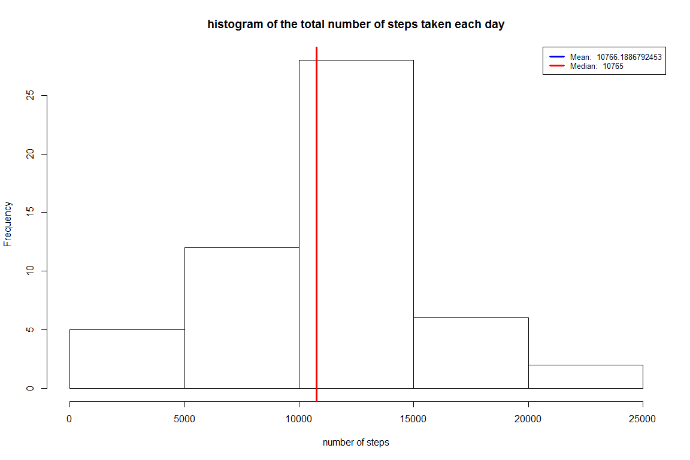
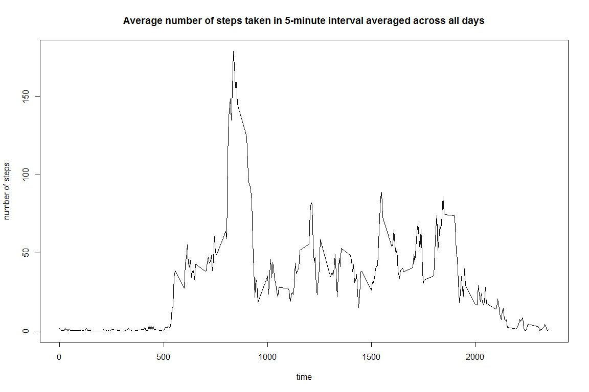
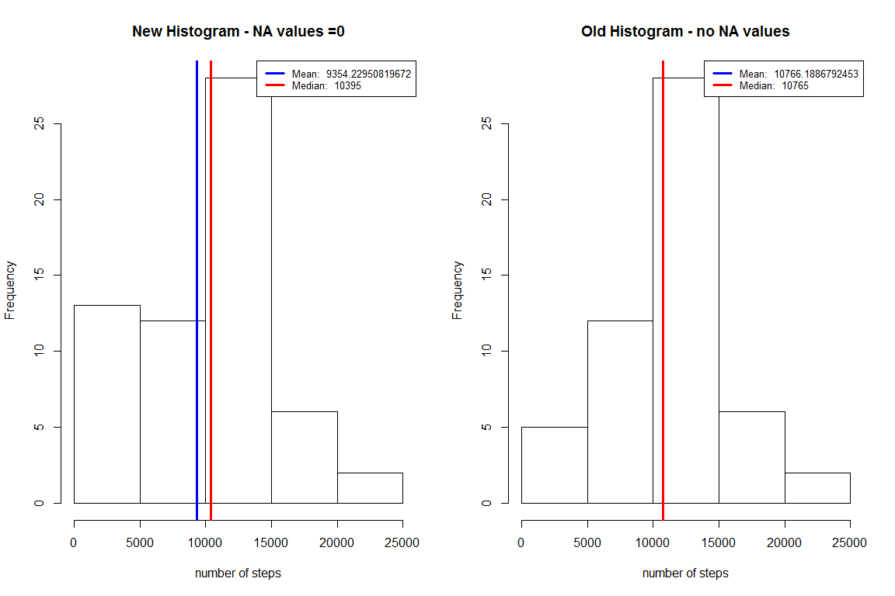
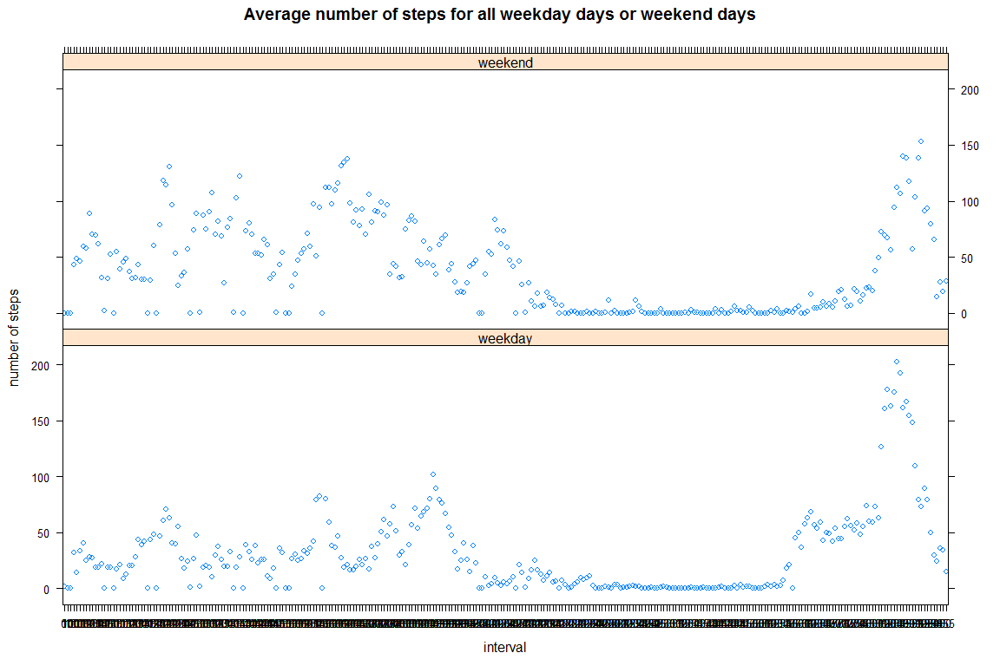

# Reproducible Research: Peer Assessment 1
Jaishree Raman  
Sunday, Sept 20, 2015  
## Overview
This assignment makes use of data from a personal activity monitoring device. This device collects data at 5 minute intervals through out the day. The data consists of two months of data from an anonymous individual collected during the months of October and November, 2012 and include the number of steps taken in 5 minute intervals each day.

### Data

The data for this assignment can be downloaded from the course web site:

Dataset: Activity monitoring data [52K]
The variables included in this dataset are:

- steps: Number of steps taking in a 5-minute interval (missing values are coded as NA)

- date: The date on which the measurement was taken in YYYY-MM-DD format

- interval: Identifier for the 5-minute interval in which measurement was taken

The dataset is stored in a comma-separated-value (CSV) file and there are a total of 17,568 observations in this dataset.

## Assignment

This assignment will be described in multiple parts. You will need to write a report that answers the questions detailed below. Ultimately, you will need to complete the entire assignment in a single R markdown document that can be processed by knitr and be transformed into an HTML file.

Throughout your report make sure you always include the code that you used to generate the output you present. When writing code chunks in the R markdown document, always use echo = TRUE so that someone else will be able to read the code. This assignment will be evaluated via peer assessment so it is essential that your peer evaluators be able to review the code for your analysis.

For the plotting aspects of this assignment, feel free to use any plotting system in R (i.e., base, lattice, ggplot2)

Fork/clone the GitHub repository created for this assignment. You will submit this assignment by pushing your completed files into your forked repository on GitHub. The assignment submission will consist of the URL to your GitHub repository and the SHA-1 commit ID for your repository state.

NOTE: The GitHub repository also contains the dataset for the assignment so you do not have to download the data separately.


## Loading and preprocessing the data

```r
setwd("E:\\Jaishree\\Coursera\\6-ReproducibleResearch")


## Loading and preprocessing the data
dataset_url<- "https://d396qusza40orc.cloudfront.net/repdata%2Fdata%2Factivity.zip"

## download the zip file into the working dir
download.file(dataset_url,"PeerAssessment1\\activity.zip")

## unzip the file into directory project1Data
unzip("PeerAssessment1\\activity.zip", exdir = "PeerAssessment1\\activity.csv")

##read the csv file
setwd("E:\\Jaishree\\Coursera\\6-ReproducibleResearch\\PeerAssessment1")
csvdata <- read.csv("activity.csv\\activity.csv")
```


## What is mean total number of steps taken per day?
- For this part of the assignment, you can ignore the missing values in the dataset.
- Calculate the total number of steps taken per day
- For the analysis, we calculate the number of steps taken per day.
- If you do not understand the difference between a histogram and a barplot, research the difference between them. Make a histogram of the total number of steps taken each day
- Calculate and report the mean and median of the total number of steps taken per day


 

The mean is 1.0766189\times 10^{4} and the median is 10765


## What is the average daily activity pattern?
- Make a time series plot (i.e. type = "l") of the 5-minute interval (x-axis) and the average number of steps taken, averaged across all days (y-axis)


 

- Which 5-minute interval, on average across all the days in the dataset, contains the maximum number of steps?


```
## [1] "This 5-minute interval, on average across all the days in the dataset, contains the maximum number of steps  "
```

```
## [1] "835"
```
   
## Imputing missing values
- Note that there are a number of days/intervals where there are missing values (coded as NA). The presence of missing days may introduce bias into some calculations or summaries of the data.

- Calculate and report the total number of missing values in the dataset (i.e. the total number of rows with NAs)


The total number of rows with NS values is 2304


- Devise a strategy for filling in all of the missing values in the dataset. The strategy does not need to be sophisticated. For example, you could use the mean/median for that day, or the mean for that 5-minute interval, etc.


 

New Mean(after replacing NA values with zero): 9354.2295082, Old Mean(after eliminating NA Values): 1.0766189\times 10^{4}

New Median(after replacing NA values with zero): 1.0395\times 10^{4}, Old Median(after eliminating NA Values): 10765

Imputing Missing data caused the mean and median to decrease, since the NA values which were previously eliminated were now counted in as zeros, thereby causing the denominator to increase in calculating the mean.

## Are there differences in activity patterns between weekdays and weekends?
For this part the weekdays() function may be of some help here. Use the dataset with the filled-in missing values for this part.

- Create a new factor variable in the dataset with two levels - "weekday" and "weekend" indicating whether a given date is a weekday or weekend day.

- Make a panel plot containing a time series plot (i.e. type = "l") of the 5-minute interval (x-axis) and the average number of steps taken, averaged across all weekday days or weekend days (y-axis). See the README file in the GitHub repository to see an example of what this plot should look like using simulated data.


 
